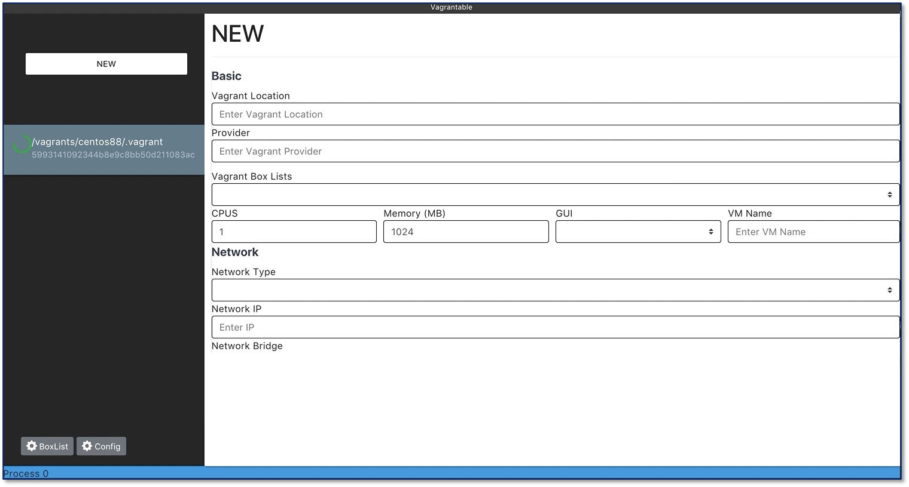
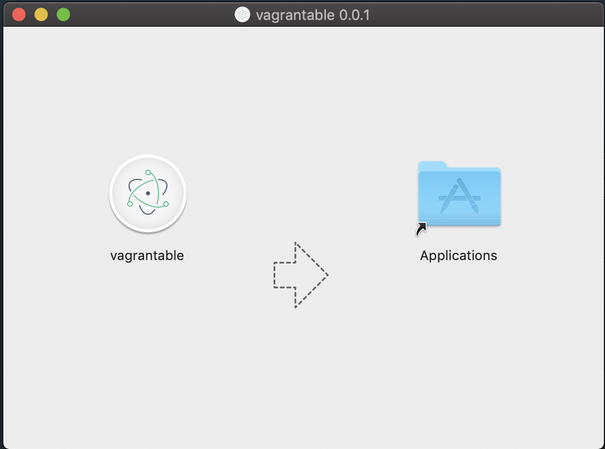

# Vagrantable

Vagrantable은 GUI를 사용하여 편리하게 Vagrant를 조작할 수 있는 도구입니다.    
Vagrant 명령어를 기반으로 동작하며 Box 동작 가상 머신 실행 중지 등의 기능을 제공합니다.   

## 설치
---
### 1. Mac

  
Click to expand!

  
  ## 설치 파일 다운로드 후, 실행하기 (dmg)
  1. 설치 파일 다운로드 링크로 이동
     * 링크 : [Release Link](https://github.com/gwangildev/Vagrantable/releases)
  2. 설치
     * 다운 받은 패키지 파일 실행
     * 실행 파일 옮기기
    
     * 끝

---

This project was generated with [electron-vue](https://github.com/SimulatedGREG/electron-vue) using [vue-cli](https://github.com/vuejs/vue-cli). Documentation about the original structure can be found [here](https://simulatedgreg.gitbooks.io/electron-vue/content/index.html).
