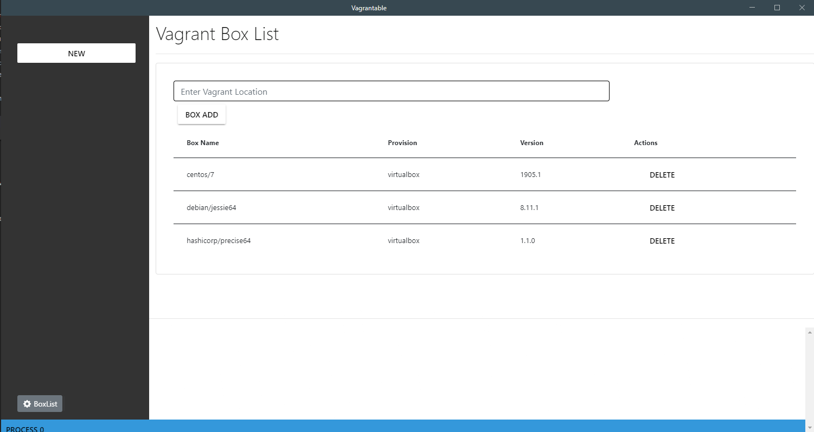
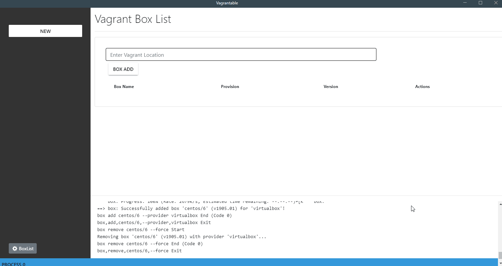

# Vagrantable

> Vagrantable은 GUI를 사용하여 편리하게 Vagrant를 조작할 수 있는 도구입니다. Vagrant 명령어를 기반으로 동작하며 Box 동작 가상 머신 실행 중지 등의 기능을 제공합니다.

## 기능
---
### 1. Vagrant Box 추가 및 설치되어 있는 리스트 확인
1-1. vagrant box 리스트 확인하기

1-2. vagrant box 추가

### 2. Vagrant 가상 머신 추가 및 수정
1-1. vagrant 추가 후 시작하기

1-2. vagrant box 추가

---

This project was generated with [electron-vue](https://github.com/SimulatedGREG/electron-vue) using [vue-cli](https://github.com/vuejs/vue-cli). Documentation about the original structure can be found [here](https://simulatedgreg.gitbooks.io/electron-vue/content/index.html).
