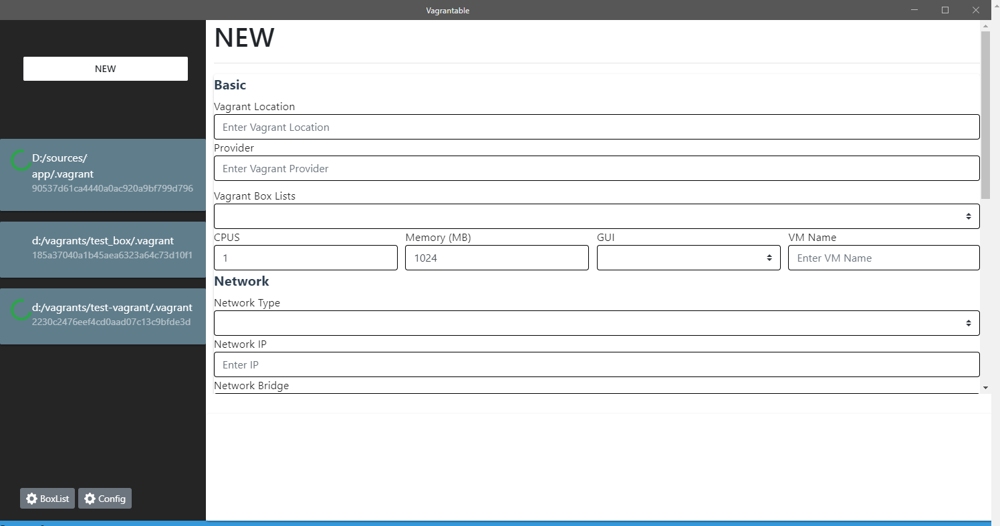
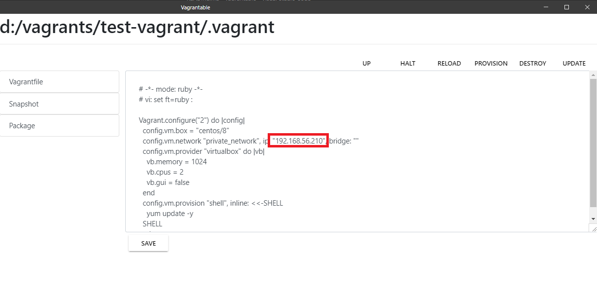
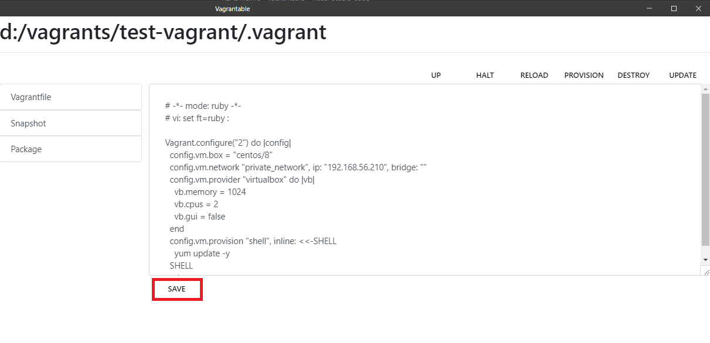
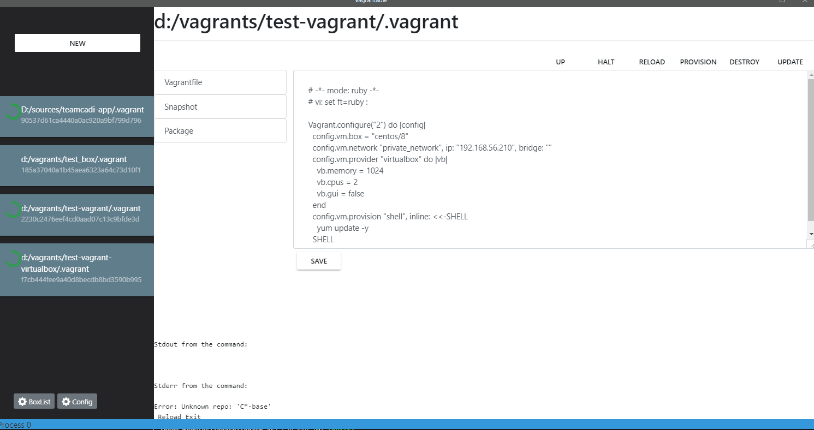

# Vagrantable

Vagrantable은 GUI를 사용하여 편리하게 Vagrant를 조작할 수 있는 도구입니다.    
Vagrant 명령어를 기반으로 동작하며 Box 동작 가상 머신 실행 중지 등의 기능을 제공합니다.   

 

## 설치

### 1. Mac에서 설치하기

  
Click to expand!

  
  ## 설치 파일 다운로드 후, 실행하기 (dmg)
  1. 설치 파일 다운로드 링크로 이동
     * 링크 : [Release Link](https://github.com/gwangildev/Vagrantable/releases)
  2. 설치
     * 다운 받은 패키지 파일 실행

### 2. Windows에서 설치하기

  
Click to expand!

  
  ## 설치 파일 다운로드 후, 실행하기 (dmg)
  1. 설치 파일 다운로드 링크로 이동
     * 링크 : [Release Link](https://github.com/gwangildev/Vagrantable/releases)
  2. 설치
     * 다운 받은 패키지 파일 실행
     * 설치가 종료되면 Vagrantable이 실행됩니다.
           

 

## 가이드
### 1. 새로운 Vagrant 가상머신 생성하기
- 설정 항목
   |이름|내용|비고|
   |---|---------------------|-----|
   |Vagrant Location|Vagrant 가상 머신 설치 경로|d:/vagrants/test-vagrant|
   |Provider|Provider|현재 Virtualbox만 지원함|
   |Vagrant Box Lists|Vagrant 설정 Box| - |
   |가상 머신 리소스|CPU, Memory 설정| - |
   |네트워크 설정|Private Network 혹은 Public Network| - |
   |Shell Script|가상 머신 실행 후, 실행 될 스크립트| - |

- 항목 설정 후, Save and start 버튼 선택
        

- 콘솔 화면에 에러 메시지가 없으면 성공!

### 2. 사용 중인 가상 머신 수정하기
- Vagrantfile 수정 후, 재시작하기
   - IP 수정
           
   - IP 수정 후 저장
           
   - 가상 머신 리로드
           
   
### 3. 사용 중인 가상 머신 삭제하기
- Destroy 버튼 클릭
     

---

This project was generated with [electron-vue](https://github.com/SimulatedGREG/electron-vue) using [vue-cli](https://github.com/vuejs/vue-cli). Documentation about the original structure can be found [here](https://simulatedgreg.gitbooks.io/electron-vue/content/index.html).
