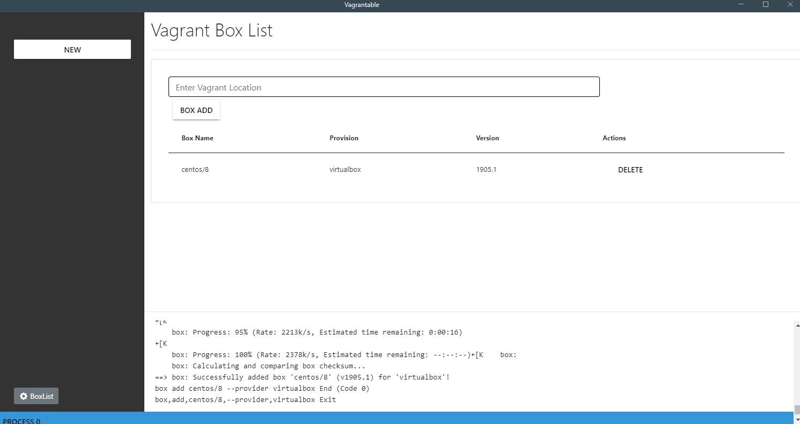

<style>
table {
    width:100%;
}
</style>

# Vagrantable

> Vagrantable은 GUI를 사용하여 편리하게 Vagrant를 조작할 수 있는 도구입니다.

## 기능
---
### 1. Vagrant Box
#### vagrant box 리스트
- 캡처

- 명령
```
vagrant box list
```

#### vagrant box 추가 및 삭제
- 캡처




``` bash
# install dependencies
npm install

# serve with hot reload at localhost:9080
npm run dev

# build electron application for production
npm run build

# run unit & end-to-end tests
npm test


# lint all JS/Vue component files in `src/`
npm run lint

```

---

This project was generated with [electron-vue](https://github.com/SimulatedGREG/electron-vue) using [vue-cli](https://github.com/vuejs/vue-cli). Documentation about the original structure can be found [here](https://simulatedgreg.gitbooks.io/electron-vue/content/index.html).
